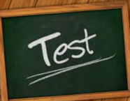

Test

A procedure intended to establish the quality, performance, or reliability of something
The test revealed a problem with the engine.
take a test / test the limits / medical test 
exam, trial, assessment
тест / испытание / проверка

Dog

A domesticated carnivorous mammal with a barking sound, often kept as a pet or for work.
The dog barked loudly at the stranger.
walk the dog / guard dog / stray dog
canine, pooch, pup
собака / пёс

